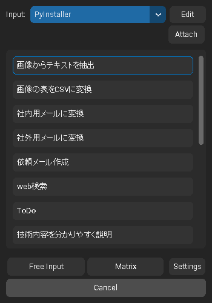
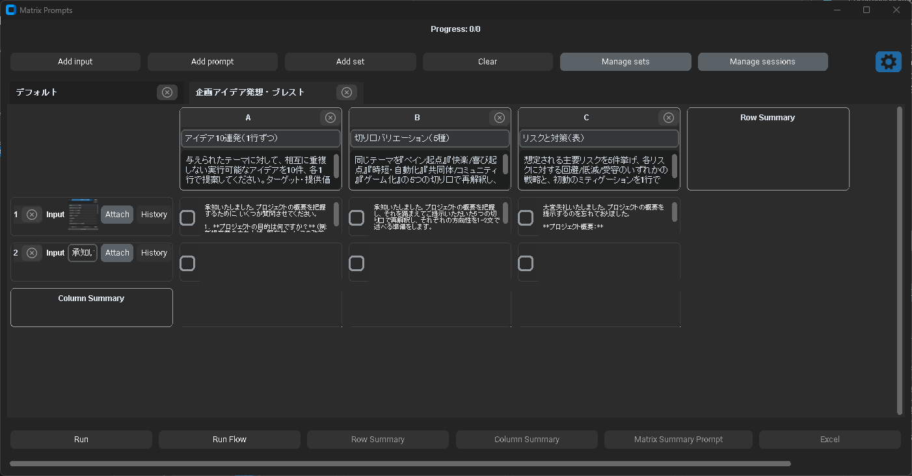
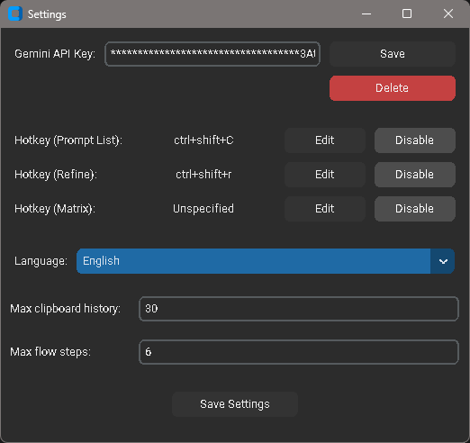
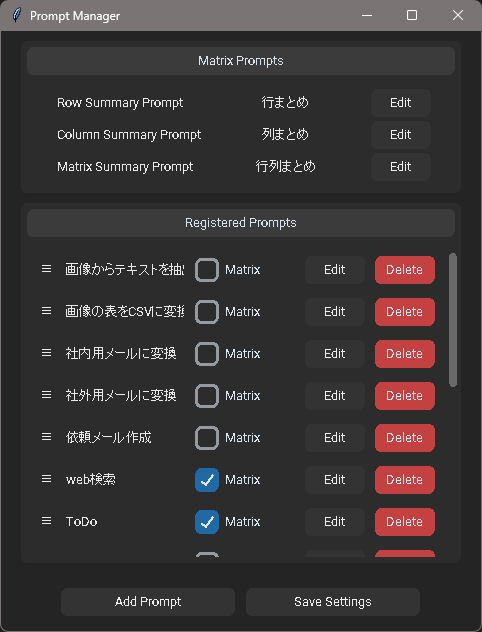
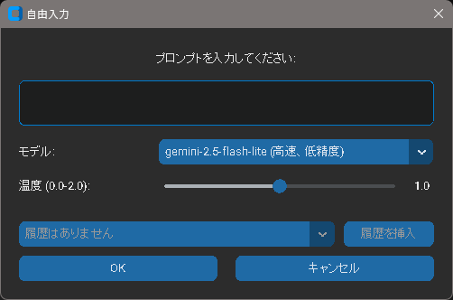
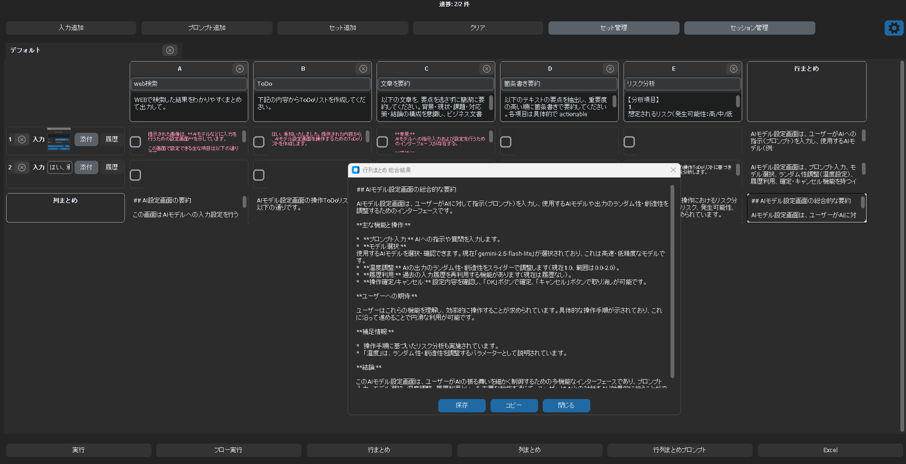

# Gem Clip (Desktop helper)

A desktop helper that sends your current clipboard (text / image / attached files) to Gemini using a selected prompt, then streams results into a lightweight popup. It includes prompt management, global hotkeys, clipboard history, and a matrix batch processor (multiple prompts × multiple inputs).

- Multi-language UI (English/Japanese, automatic detection)
- Cross‑platform (Windows/macOS/Linux)
- Keys stored securely via OS keyring

Note: At this time, the application has only been tested on Windows. Other platforms are unverified and not guaranteed to work yet (community feedback/PRs are welcome).

## Screenshots

Prompt List (Action Selector)



Matrix Batch Processor



## Quick Start
```bash
python -m venv .venv
source .venv/bin/activate   # Windows: .venv\Scripts\activate
pip install -r requirements.txt
python main.py
```
On first run, open Settings and save your Gemini API key (stored via OS keyring). If you want dev tooling: `pip install -r requirements-dev.txt`.

Note: Tkinter is included with many distributions (do not install it via pip unless needed).

## Operation Manual
### 1) First Run & Settings



- Run `python main.py`.
- Open Settings:
  - Save your Gemini API key (stored in OS keyring)
  - Choose Language: Auto / English / 日本語
  - Set hotkeys (Prompt List / Refine / Matrix)
  - Set clipboard history size and optional flow steps

### 2) Prompt Management (Main Window)



- Add / Edit / Delete prompts; drag to reorder.
- Toggle “Matrix” on a prompt to include it in the default Matrix set.
- Each prompt has Model, Parameters (temperature/top_p/top_k/etc.), System Prompt, and optional Web Search.
- Click “Save Settings” to persist changes.

### 3) Action Selector (Quick Run)



- Press `Ctrl+Shift+C` to open the quick selector near the cursor.
- Pick from Clipboard History (text/image/file) and optionally attach additional files.
- Choose a prompt to run.
- Cancel with Esc or the Cancel button.

### 4) Refine (Additional Instruction)
- Press `Ctrl+Shift+R` to apply a follow-up instruction to the last result.
- Enter the additional instruction and run. The UI sends your last output plus the instruction and asks Gemini to return only the updated final text.

### 5) Clipboard History
- The agent continuously collects clipboard items (text / images / files), deduplicating by content.
- Use history from the Action Selector or from the Matrix input rows (“History” button).

### 6) Matrix Batch Processor (detailed)
Launch
- Open from the tray (Matrix) or via a configured hotkey. You can also open from the Action Selector (Matrix button).

Layout
- Top bar: “Run”, “Run Flow”, Row/Column/Matrix summary buttons (enabled after runs), Export (copies TSV to clipboard).
- Toolbar: Add Input, Add Prompt, Add Set, Manage Sets, Manage Sessions, Clear current tab.
- Tab bar: up to 5 tabs; double‑click a tab title to rename, use the × button in the tab content for deletion. Use presets to populate a set.
- Grid: leftmost column is Inputs (one row per input); prompt columns sit to the right (A, B, C…).
- Optional areas: a Row Summary column (appears on the far right) and a Column Summary row (appears at the bottom) after summarization.

Inputs (left column)
- Click “Add input” to create a new row.
- For each row:
  - Text input shows a compact read‑only entry. Click it to open a simple editor.
  - Images show a thumbnail. Click the image to open a preview dialog.
  - Files show the filename; hover to see full path.
  - “Attach” lets you pick a file (image/PDF/text/etc.). If an image is selected, it’s embedded as base64 for processing.
  - “History” opens a popup listing recent clipboard items (text/image/file) — pick one to set the row input.
  - Use the row’s × button to delete that input row.

Prompts (top columns)
- Click “Add prompt” to add a new prompt column. A default name and placeholder instruction are created.
- Click the prompt header to edit the prompt (name/model/parameters/system prompt/web search).
- Drag prompt headers horizontally to reorder columns. Use the column’s × button to delete a prompt.

Selecting cells and running
- Each grid cell (row × prompt) has a checkbox. Tick the cells you want to run.
- Click “Run” to execute all checked cells. Results stream into each cell; click a cell to open its full preview (Save/Copy/Close).
- “Run Flow” executes per row in A→B→C order (based on column order). The confirmation dialog shows steps per row and warns if existing values will be overwritten. A small flow dialog lets you stop the process.

Summaries



- Row Summary: after runs, click “Row Summary” to generate a summary for each input row. A new summary column appears; click a summary cell to preview.
- Column Summary: similarly, generates one summary per prompt column; a summary row appears at the bottom.
- Matrix Summary: generates an overall summary from combined row/column summaries. The final summary is copied to clipboard and shown in a preview dialog; Save to persist into the bottom‑right cell.

Sets and Sessions
- Add Set: create a new tab from a preset. Presets include “Default” (all prompts marked “Matrix” in the main manager) or “Empty Set”, plus your saved presets.
- Manage Sets: save the current tab’s prompt set as a preset (JSON under `prompt_set/`).
- Manage Sessions: save/load/delete a multi‑tab working session (including tab content and state).

Export to Excel
- Click Export to copy a TSV‑style table to the clipboard (headers + results + optional row/column summaries). Paste into Excel/Sheets.

Tips
- Image previews open in a separate dialog; close to return.
- If no cells are checked, the app warns you and won’t run.
- Safety blocks (model safety filters) and API errors are surfaced in notifications and cell messages.

### 7) Tray Menu
- Right‑click tray icon for: List (Action Selector), Matrix, Prompt Manager, Settings, Quit.

## Internationalization (i18n)
- Language can be changed in Settings.
- All user‑facing text uses `tr("key", **kwargs)`. Language files are in `locales/<lang>.json`.
- To add a language: copy `locales/en.json` and translate. The resolver falls back to English, then the key.

## Troubleshooting
- Hotkeys: if registration fails on Windows, the app falls back to the `keyboard` library. Some OS-level restrictions may apply.
- Tk errors: ensure a system Tk is available and the Python Tk bindings are installed.
- API key: ensure it’s set in Settings; the app notifies if missing.

## Repository Structure
- `main.py`: Entry (logging init → app start)
- `app.py`: Prompt management UI
- `agent.py`: Clipboard monitor / hotkeys / notifications / Gemini calls
- `ui_components.py`, `styles.py`: UI components and styles
- `common_models.py`, `config_manager.py`: models and config
- `matrix_batch_processor.py`: Matrix processor (batch, summary, export)

## Contributing
- Branches: `feature/...`, `fix/...`, `chore/...`
- Commits: small, imperative (e.g., “Add i18n for matrix previews”)
- PRs: include summary, rationale, scope, screenshots (UI), testing steps, config/migration notes
- i18n: when adding user-facing text, update `locales/en.json` and other locales

## License
- Project license: MIT (see `LICENSE`). You may use, copy, modify, distribute, and sublicense under the terms of the MIT License.
- Third‑party notices: see `THIRD_PARTY_LICENSES.md`.
- Unofficial notice: This application is not affiliated with Google; “Gemini” is a product of Google LLC.
