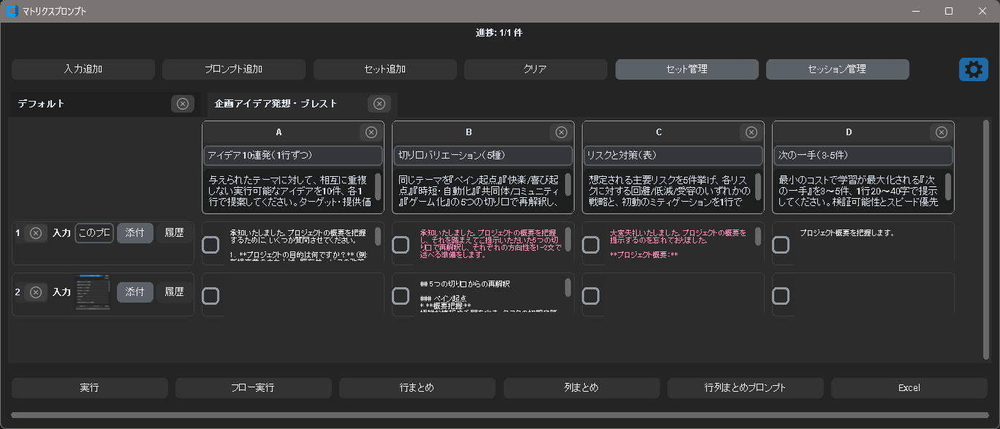
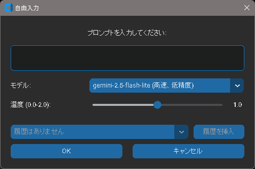

# Gemini クリップボード（デスクトップ補助）操作説明書

選択した「プロンプト」で OS のクリップボード（テキスト / 画像 / 添付ファイル）を Gemini に投げ、結果を軽量ポップアップでストリーミング表示します。プロンプト管理、グローバルホットキー、履歴活用、マトリクス（複数プロンプト×複数入力の一括検証）を備えています。

> 注意: 現時点では Windows 環境でのみ動作検証済みです。macOS/Linux は未検証のため、動作保証はありません（フィードバック/PR歓迎）。

- 多言語対応（英語/日本語、自動検出）
- クロスプラットフォーム（Windows/macOS/Linux）
- APIキーは OS の keyring に安全に保存

## スクリーンショット

リスト表示（アクションセレクタ）


マトリクスプロンプト



## クイックスタート
```bash
python -m venv .venv
source .venv/bin/activate   # Windows: .venv\Scripts\activate
pip install -r requirements.txt
python main.py
```
初回起動後に「設定」から Gemini API キーを保存してください（OS の keyring に格納）。開発用ツールは `pip install -r requirements-dev.txt`。

注: 多くのディストリビューションでは Tkinter は同梱されています。

## 操作手順
### 1) 初回起動と設定
- `python main.py` を実行。
- 設定画面で以下を行います:
  - Gemini API キーの保存（OS keyring に保存）
  - 言語（Language）を `Auto / English / 日本語` から選択
  - ホットキー（リスト/追加指示/マトリクス）を設定
  - クリップボード履歴件数、フローステップ上限を必要に応じて調整


### 2) プロンプト管理（メイン画面）
- 追加 / 編集 / 削除 / 並べ替え（ドラッグ）に対応。
- プロンプトの「マトリクス」をオンにすると、マトリクスの既定セットに含まれます。
- 各プロンプトにはモデル、生成パラメータ（温度/top_p/top_k など）、システムプロンプト、任意の Web 検索の有効化が設定できます。
- 「保存」で設定を永続化。


### 3) クイック実行（アクションセレクタ）
- `Ctrl+Shift+C` でカーソル付近にポップアップ表示。
- クリップボード履歴（テキスト / 画像 / ファイル）を選択、必要であればファイル添付。
- 実行したいプロンプトを選択して実行。
- Esc または「キャンセル」で閉じます。



### 4) 追加指示（Refine）
- `Ctrl+Shift+R` で直近結果への追加入力を実行。
- 追加の指示を入力して実行。前回結果と指示を一緒に送り、更新後の最終文のみを返すよう促します。

### 5) クリップボード履歴
- エージェントがテキスト / 画像 / ファイルを自動で履歴化（重複は内容で統合）。
- アクションセレクタやマトリクスの「履歴」ボタンから選択可能です。

### 6) マトリクス一括検証（詳細）
起動
- トレイの「マトリクス」または設定したホットキーから起動。アクションセレクタ（Matrix ボタン）からも開けます。

画面構成
- 上部バー：
  - 「実行」「フロー実行」ボタン、行/列/行列サマリー生成ボタン（実行後に有効化）、エクスポート（Excel貼り付け用TSVコピー）
- ツールバー：
  - 「入力追加」「プロンプト追加」「セット追加」「セット管理」「セッション管理」「クリア（タブ内容初期化）」
- タブバー：最大5タブ。タブ名はダブルクリックで変更、不要なタブは×で削除。プリセットからセット追加も可能。
- グリッド：最左列が入力、右方向にプロンプト列（A, B, C…）。
- 追加生成されたサマリー領域：右端に行サマリー列、下端に列サマリー行が現れます。

入力（左列）
- 「入力追加」で行を増やします。
- 各行について：
  - テキスト：簡易表示（クリックで編集ダイアログを表示）
  - 画像：サムネイル（クリックでプレビュー表示）
  - ファイル：ファイル名（ホバーでフルパスのツールチップ）
  - 「添付」ボタン：画像/PDF/テキスト等のファイルを選択（画像はbase64化して送信）
  - 「履歴」ボタン：直近のクリップボード（テキスト/画像/ファイル）から選択
  - 行の×ボタンで入力行を削除

プロンプト（上部列）
- 「プロンプト追加」で列を追加（既定名とひな型プロンプトが生成）。
- 列ヘッダをクリックしてプロンプト編集（名前/モデル/パラメータ/システムプロンプト/ウェブ検索）。
- ヘッダをドラッグして列順入替、×で削除。

セルの選択と実行
- 各セル（行×列）にチェックボックスがあります。実行したいセルをチェック。
- 「実行」で通常実行：各セルにストリーミングで結果が入り、クリックでフルプレビューダイアログ（保存/コピー/閉じる）。
- 「フロー実行」で行単位に A→B→C の順で連続実行。確認ダイアログに各行のステップ数が表示され、上書き注意が表示されます。進行ダイアログから停止も可能。

サマリー
- 行サマリー：実行後「行まとめ」で各行の要約を生成。右端にサマリー列が現れ、クリックでプレビュー。
- 列サマリー：同様に各列の要約を生成。下端にサマリー行が現れます。
- 行列サマリー：行/列サマリーを統合した総合要約を生成。クリップボードにもコピーし、プレビュー（保存/コピー/閉じる）可能。


セットとセッション
- 「セット追加」：プリセットから新しいタブを作成（既定セット、空のセット、保存済みプリセット）。
- 「セット管理」：現在のタブのプロンプトセットをプリセットとして保存/削除（`prompt_set/` 配下）。
- 「セッション管理」：複数タブを含む作業状態を保存/呼び出し/削除（入力/結果/チェック状態など）。

エクスポート（Excel）
- クリックでヘッダ＋結果＋（必要なら）行/列サマリーをTSV風にクリップボードへコピー。Excel/スプレッドシートへ貼り付け可能。

ヒント
- 画像プレビューは別ダイアログ表示。閉じると戻ります。
- チェックされたセルがない場合はエラー表示され実行しません。
- セーフティブロックやAPIエラー時は通知/セルにエラーメッセージが表示されます。

### 7) トレイメニュー（タスクトレイ/メニューバー）
- 右クリックで「リスト表示」「マトリクス」「プロンプト管理」「設定」「終了」にアクセス。

## 多言語化（i18n）
- 言語は設定画面で切り替え可能。
- すべての表示テキストは `tr("key")` で取得し、`locales/<lang>.json` に定義します。
- 言語追加は `locales/en.json` をベースに `<code>.json` を追加してください。解決順は「現在の言語 → 英語 → キー文字列」です。

## トラブルシュート
- ホットキー：Windows で OS 側の制限で登録に失敗する場合、`keyboard` ライブラリによるフォールバックが動作します。
- Tk 関連：システムに Tk と Python 用 Tk バインディングがあることを確認してください。
- API キー未設定：設定から保存してください（未設定時は通知されます）。

## リポジトリ構成
- `main.py`: エントリ（ログ初期化 → アプリ起動）
- `app.py`: プロンプト管理 UI
- `agent.py`: クリップボード監視 / ホットキー / 通知 / Gemini 呼び出し
- `ui_components.py`, `styles.py`: UI コンポーネントとスタイル
- `common_models.py`, `config_manager.py`: モデルと設定
- `matrix_batch_processor.py`: マトリクス処理（実行・サマリー・出力）

## コントリビュート
- ブランチ: `feature/...`, `fix/...`, `chore/...`
- コミット: 小さく、命令形（例「Add i18n for matrix previews」）
- PR: 目的/背景/範囲、UI 変更のスクリーンショット、テスト手順、設定/マイグレーション注意点
- i18n: 画面文言を追加/変更したら `locales/en.json` などを更新

## ライセンス
- 本プロジェクトのライセンス: MIT（`LICENSE` を参照）。MIT の条件に従い、使用・複製・改変・再配布・サブライセンスが可能です。
- サードパーティライセンス/告知: `THIRD_PARTY_LICENSES.md` を参照。
- 非公式の注意: 本アプリは Google の非公式クライアントであり、Google による承認/提携/支援を受けていません（“Gemini” は Google LLC の製品名）。
