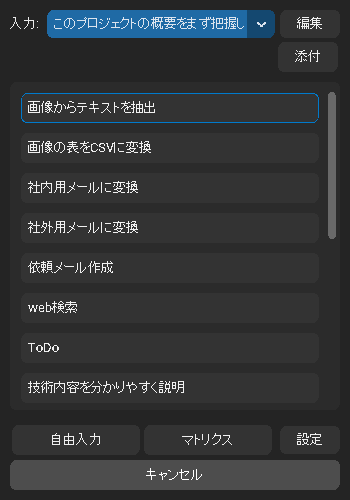
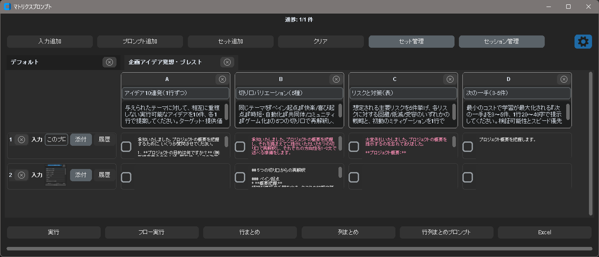

# Gem Clip (Desktop helper)

> Documentation in English is available in `README.en.md`.
> 英語版マニュアルは `README.en.md` にあります。日本語版の詳細マニュアルは `README.ja.md` を参照してください。

システムのクリップボード（テキスト / 画像 / 添付ファイル）を選択したプロンプトで Gemini に投げ、結果を軽量ポップアップにストリーミング表示するデスクトップ補助ツールです。プロンプトの管理、グローバルホットキー、履歴活用、マトリクス比較（複数プロンプト×複数入力の一括検証）を備えています。

## 主要機能
- プロンプト管理（追加/編集/並び替え/削除）
- クリップボード履歴からの入力選択、添付ファイル併用
- グローバルホットキー（リスト表示/追加指示/マトリクス）
- ストリーミング通知ポップアップ（自動クローズ）
- マトリクス一括検証＋行/列/最終サマリー
- 多言語化（英語/日本語、Auto 検出、任意追加可能）

## 動作環境
- Python 3.10+
- Windows / macOS / Linux（Windows ではホットキー信頼性向上）
- 注意: 現時点では Windows 環境でのみ動作検証済みです。他OSは未検証のため、動作を保証しません（フィードバック/PR歓迎）。

## セットアップ
```bash
python -m venv .venv
source .venv/bin/activate   # Windows: .venv\\Scripts\\activate
pip install -r requirements.txt
python main.py
```
初回起動後に設定ダイアログから Gemini API キーを保存してください（OS の keyring に安全に保存）。

開発用ツール（任意）を使う場合:
```bash
pip install -r requirements-dev.txt
```

注: tkinter は多くのディストリビューションで同梱されています（pip からは入れません）。

## 使い方（概要）
- `Ctrl+Shift+C`: プロンプトリストを表示し、履歴/添付を選んで実行
- `Ctrl+Shift+R`: 直近結果への追加指示
- マトリクス: リストから起動 or 設定でホットキーを割り当て

トレイメニュー（タスクトレイ/メニューバー）からも主要機能にアクセスできます。

## 操作説明書（ダイジェスト）
- 初回起動とAPIキー設定
  - `python main.py` を実行 → 設定画面から Gemini API キーを保存（OS `keyring` に格納）
  - 言語は Settings > Language で `Auto/English/日本語` から選択
- プロンプト管理（メインウィンドウ）
  - 追加/編集/削除/並べ替え（ドラッグ）
  - 「マトリクス」にチェック → Matrix 既定セットに含める
- クイック実行（Action Selector / ホットキー）
  - `Ctrl+Shift+C` でポップアップを開き、履歴を選び、添付があれば追加 → 任意のプロンプトを実行
  - `Ctrl+Shift+R` で直近結果への追加指示（Refine）
- クリップボード履歴
  - テキスト/画像/ファイルを自動で履歴化。Action Selector と Matrix の「履歴」から選択可能
- マトリクス一括検証
  - 入力列（左）にテキスト/画像/ファイルを行ごとに追加
  - 上部列にプロンプトを追加（ヘッダの×で削除、ドラッグで並べ替え）
  - チェックボックスで実行対象を選び「実行/フロー実行」
  - 行/列/全体サマリー、Excel 形式でのコピー出力（貼り付け）にも対応

より詳しい手順は `README.ja.md` を参照してください（英語は `README.en.md`）。

## スクリーンショット

リスト表示（アクションセレクタ）



マトリクスプロンプト



## リポジトリ構成
- `main.py`: エントリポイント（ログ初期化→アプリ起動）
- `app.py`: プロンプト管理 UI
- `agent.py`: クリップボード監視 / ホットキー / 通知 / Gemini 呼び出し
- `ui_components.py`, `styles.py`: UI 部品とスタイル
- `common_models.py`, `config_manager.py`: モデルと設定（自動マイグレーション）
- `matrix_batch_processor.py`: マトリクス比較

## 多言語化（i18n）
- 設定画面の「Language」で `Auto / English / 日本語` を選択できます（`Auto` はOSのロケールを検出）。
- 文言は `locales/<lang>.json` で管理します。新しい言語を追加したい場合は、`locales/en.json` を参考に `<code>.json` を追加してください。
- コードからの参照は `from i18n import tr` で `tr("key", **kwargs)` を使用します（英語→キーの順でフォールバック）。

## セキュリティとプライバシー
- APIキーは OS の `keyring` に保存します（平文でファイル保存しません）。
- ユーザー固有の `config.json` は初回起動時にユーザー領域へ作成され、リポジトリにはコミットしません。
- 画像/ファイルの一時処理はローカルで行います。アップロードはユーザー操作・設定に応じて明示的に実施します。

## 開発・コントリビュート
- ブランチ: `feature/...`, `fix/...`, `chore/...`
- コミット: 小さく、目的が明確な命令形（例: "Add i18n for matrix previews"）
- PR テンプレートに従って、UI変更はスクリーンショット、i18n 変更は `locales/*` 更新を含めてください。
 - テスト（任意）: `pytest`（pure helper を中心に）。GUIは手動動作確認を推奨。
 - 共有用に `.gitignore` はコミットしていません。ローカルでは `cp .gitignore.example .gitignore` してご利用ください（コミット対象外推奨）。

## ライセンス / 告知
- 本プロジェクトのライセンス: MIT（`LICENSE` 参照）。
- 依存ライブラリのライセンス・告知は `THIRD_PARTY_LICENSES.md` を参照してください。
- 非公式の注意: 本アプリは Google の非公式クライアントであり、Google による承認/提携/支援を受けていません（“Gemini” は Google LLC の製品名）。

## 追加ドキュメント
- 配布・パッケージングガイド: `DISTRIBUTION.md`
- プライバシーとデータ取扱い: `PRIVACY.md`
- セキュリティ方針（脆弱性報告）: `SECURITY.md`
- サポート/問い合わせ方針: `SUPPORT.md`

## 開発メモ
- テストは pure helper を中心に `pytest` を推奨（任意）
- 秘密情報はコミットしないでください（API キーは keyring に保存）
- 設定ファイルはユーザ領域に作成され、`.gitignore` 済みです

---
改善提案・不具合報告は Issue/Pull Request にて歓迎します。
